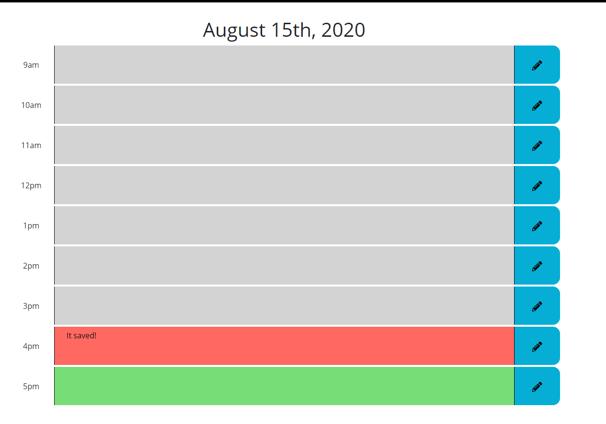

# Work-Schedule-Planner

In this project I design a schedule planner that the user can save important information on. If the hour has passed
the time block will change to a gray color. If the hour is the current hour, the hour will change to a red color.

https://oops-sayonara.github.io/Work-Schedule-Planner/index.html

